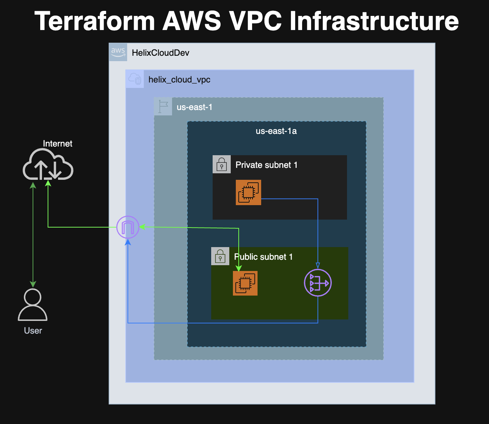

# Terraform AWS VPC Infrastructure

- Provisioned a custom AWS VPC using Terraform with public and private subnets, Internet Gateway, NAT Gateway, route tables, security groups, and EC2 instances. Validated bastion-based SSH access to a private EC2 instance and confirmed outbound internet connectivity from the private subnet by installing Nginx through the NAT Gateway path.
---

## Architecture Overview

---

## AWS Resources Created

- VPC
- Public Subnet 1 + Public Subnet 2
- Private Subnet 1 + Private Subnet 2
- Internet Gateway
- Elastic IP
- NAT Gateway
- Public Route Table
- Private Route Table
- Public Security Group
- Private Security Group
- Public EC2 Instance
- Private EC2 Instance
---

## Network Flow

- Public EC2 receives SSH access from the internet
- Private EC2 does not have a public IP
- Private EC2 is accessible only from the Public EC2 using Security Group-based SSH access
- Private EC2 uses NAT Gateway for outbound internet connectivity
---

## Security Design

- Public Security Group allows SSH on port 22 from `0.0.0.0/0` for lab purposes
- Private Security Group allows SSH on port 22 only from the Public EC2 Security Group
- Security Groups were configured to support secure bastion-to-private instance access
---

## Terraform Files

- `provider.tf` – AWS provider + Terraform block
- `vpc.tf` – VPC resource
- `subnets.tf` – Public & private subnets
- `internet-gateway.tf` – Internet Gateway
- `public-routing.tf` – Public route table & associations
- `nat-gateway.tf` – Elastic IP & NAT Gateway
- `private-routing.tf` – Private route table & associations
- `security-groups.tf` – Security groups & ingress/egress rules
- `ec2.tf` – Public & private EC2 instances
- `outputs.tf` – Terraform outputs
---

## Validation Performed

The following access pattern was tested:
- SSH from local machine to Public EC2
- SSH from Public EC2 to Private EC2
- Installed NGINIX to check Private EC2 connection to Internet

